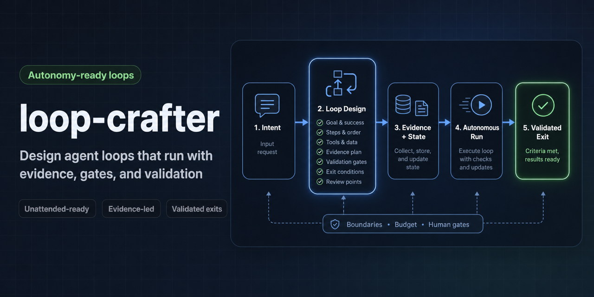

<h1 align="center">loop-crafter</h1>

<p align="center">
  
</p>

<p align="center">
  <strong>Design unattended-ready agent loops with evidence, gates, state, and validated exits.</strong>
</p>

<p align="center">
  <a href="#quickstart"></a>
  <a href="docs/loop-crafter-v2-requirements.md"></a>
  <a href="docs/PUBLICATION_READINESS.md"></a>
  <a href="LICENSE"></a>
</p>

AI agents can keep working for a long time, but unattended work only stays useful when the loop is explicit: what success means, which evidence is allowed, what state changes, how validation works, and when the agent must stop or escalate.

`loop-crafter` is a Codex skill for turning recurring agent workflows into loop packages. The goal is not to prevent unattended execution. The goal is to make owner-authorized autonomous runs more controlled, accurate, and verifiable before they become scaffolds, automation, or repository changes.

Use it when you want an agent to move efficiently through repeatable work without losing the practical controls that make the result trustworthy: evidence, state, validation, budgets, human gates, and safe exits.

| Without a loop package | With `loop-crafter` |
| --- | --- |
| "Keep going until done" depends on chat memory and assumptions. | The loop defines goal, trigger, evidence, roles, validation, state, and stop conditions. |
| Unattended work can drift across scope, files, or external effects. | Boundaries and budgets are explicit before the run starts. |
| Success is judged after the fact. | Validation and exit criteria are designed into the loop. |
| Review happens only when someone notices risk. | Human gates and PM/Advisor checkpoints are part of the package. |

## What It Designs

`loop-crafter` helps define:

- the outcome the loop must reach;
- the evidence the agent may inspect;
- the roles involved in the work;
- the state and run-log expectations;
- the validation harness or review rubric;
- the budget, retry, stop, and recovery rules;
- the human gates before writes, git exits, publication, or other external effects.

## Maturity

Current status: early public baseline.

- V1 is design/review-first.
- V2 requirements are documented as `v0.1.1`.
- V2 adds scaffold proposals, readiness reports, and validation harness designs.
- V2 is aimed at unattended-ready loop design, while execution, file writes, and external effects remain gated by owner/project rules.

Current public release: `v0.1.1`. There is no package-registry entry yet.

## Quickstart

Use this repository as a local Codex skill source.

```bash
git clone https://github.com/alexsglife-re/loop-crafter.git
cd loop-crafter
```

To install it into a local Codex skills directory, copy the repository contents into a skill folder named `loop-crafter`.

```bash
mkdir -p "$HOME/.codex/skills/loop-crafter"
cp -R SKILL.md agents references "$HOME/.codex/skills/loop-crafter/"
```

Then ask Codex to use `loop-crafter` when designing or reviewing a recurring workflow.

Example prompt:

```text
Use loop-crafter to design an unattended-ready loop for preparing a release note.
The loop may read git history and validation docs. It should define evidence,
state, validation, budget, stop conditions, and owner gates before any tag,
release, deployment, or publication.
```

## Typical Outputs

`loop-crafter` can produce:

- loop design packages
- scaffold proposals
- readiness reports
- validation harness designs
- scaffold write packets that stop for owner authorization

These outputs are meant to make repeated or owner-authorized autonomous work easier to run, review, and verify.

## Boundaries

`loop-crafter` designs the loop package. It does not, by itself:

- execute unattended runs;
- grant permission to write files, commit, push, tag, release, deploy, or publish;
- read secrets, credentials, Keychain data, browser data, or unrelated projects;
- replace project governance, owner decisions, tests, CI, or PM/Advisor review;
- make an unsafe loop safe just by naming it a loop.

When a loop needs multi-agent governance, `loop-crafter` designs the loop package and `multi-agent-working-group` controls execution governance.

## Repository Map

- `SKILL.md`: Codex skill entrypoint.
- `references/`: loop design, scaffold, readiness, safety, validation, and example references.
- `agents/openai.yaml`: agent-facing metadata.
- `docs/loop-crafter-design.md`: design source for the initial skill.
- `docs/loop-crafter-v2-requirements.md`: V2 requirements package.
- `CHANGELOG.md`: public release history.
- `scripts/validate-local.sh`: lightweight local validation command.
- `.github/workflows/validate.yml`: GitHub Actions workflow that runs local validation.
- `docs/validation/`: validation evidence and review packets.

## Validation

The repository uses a lightweight local validation script plus GitHub Actions.

```bash
./scripts/validate-local.sh
```

Key validation areas:

- scaffold proposal output
- readiness report output
- validation harness design output
- safety gates for unsafe scaffold or publication requests
- routing multi-agent execution governance back to `multi-agent-working-group`

## Contributing

Contributions should keep the skill review-first, conservative, and easy to inspect. Start with `CONTRIBUTING.md` and avoid adding automation, publishing behavior, or external side effects without a reviewed design and explicit owner authorization.

## Security

Do not include secrets, credentials, tokens, private keys, local machine paths, or private account details in issues, examples, transcripts, or pull requests. See `SECURITY.md`.
